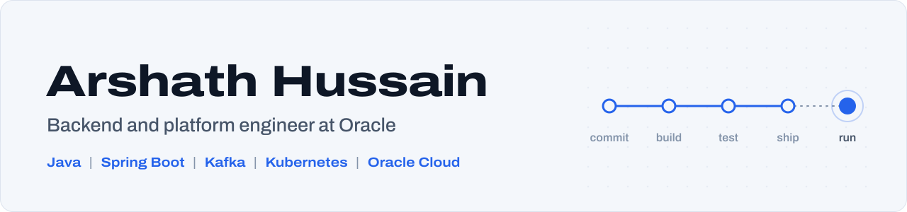

<picture>
  <source media="(prefers-color-scheme: dark)" srcset="banner-dark.svg">
  
</picture>

I build backend services and the platforms they run on.

At **Oracle** I own environment buildouts and upgrades across **60+ customer and internal environments** on Oracle Cloud Infrastructure: provisioning Kubernetes clusters, deploying applications, running schema upgrades and data backfills, and getting each environment ready for production. When a pod won't start or a GoldenGate replication stalls, I trace it back to the cause and get delivery moving again.

Before that, at **WAVCOM Technology**, I built Java and Spring Boot backends for telecom systems, including a Kafka pipeline that keeps call records in sync across network nodes and **cut update latency by about 70%**.

Right now I'm going deeper on platform engineering: CI/CD, containers, Kubernetes and infrastructure as code.

## Featured projects

<table>
  <tr>
    <td width="50%" valign="top">
      
      <h3><a href="https://github.com/Arshath1470/hungrybox">HungryBox</a></h3>
      
Event-driven food delivery platform. Four Spring Boot microservices coordinate orders and payments over Kafka, with idempotent consumers and dead-letter topics. Ships with Docker Compose, hardened Kubernetes manifests and a CI pipeline that publishes images to GHCR.

      
<code>Java 21</code> <code>Spring Boot</code> <code>Kafka</code> <code>MySQL</code> <code>React</code> <code>Kubernetes</code> <code>GitHub Actions</code>

    </td>
    <td width="50%" valign="top">
      
      <h3><a href="https://github.com/Arshath1470/face-recognition-app">FaceFinder</a></h3>
      
Face detection web app. Upload a photo or paste a link and every face is circled, numbered and scored using Clarifai. JWT accounts, scan history, privacy-first storage and integration tests against PostgreSQL.

      
<code>React</code> <code>Node.js</code> <code>Express</code> <code>PostgreSQL</code> <code>Docker</code> <code>Clarifai API</code>

    </td>
  </tr>
</table>

Also here: **[DecorGenie](https://github.com/Arshath1470/decorgenie)**, an AI interior designer for Indian homes that turns a room photo into redesigns, colour palettes, layouts and budgets (Next.js, FastAPI, Claude, Supabase).

## What I work with

**Backend**&nbsp;

**Cloud and platform**&nbsp;

**Data**&nbsp;

**Frontend**&nbsp;

## Certifications

- Oracle Cloud Infrastructure Foundations Associate
- Oracle AI for You
- Linux Basics Course and Labs, KodeKloud

## Get in touch

